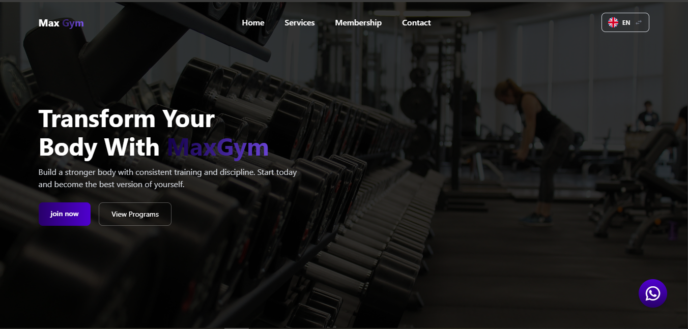
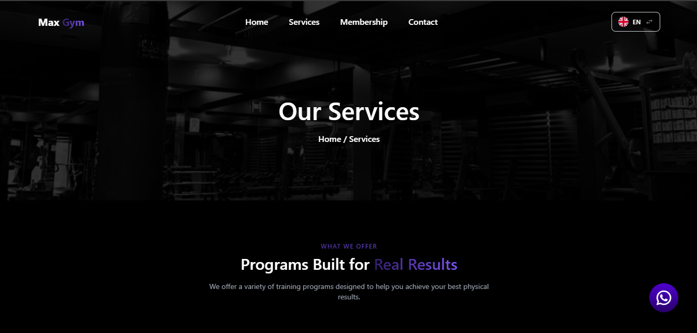
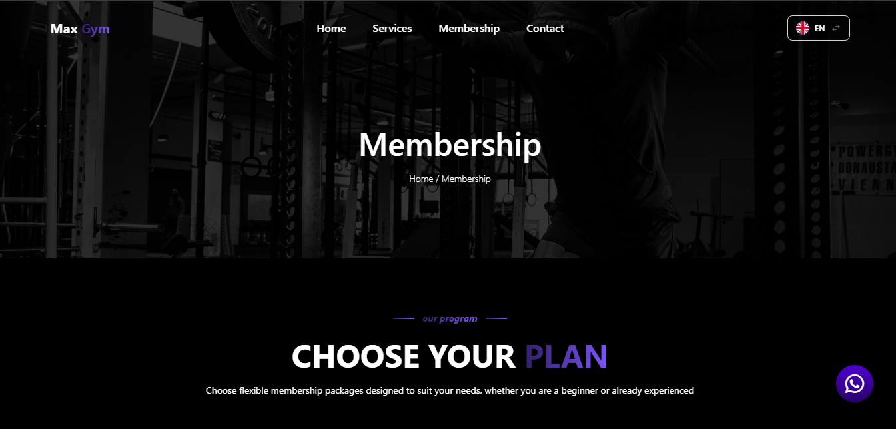

# 🏋️ Max Gym — Performance Website

Modern gym website dengan tampilan dark mode, responsif, dan dukungan multi-bahasa (Indonesia & English). Dibangun menggunakan PHP dan Tailwind CSS dengan struktur modular.

---

## 🚀 Overview

Website ini dirancang untuk menampilkan layanan gym secara profesional dengan pengalaman pengguna yang modern, ringan, dan mudah digunakan.

---

## 📸 Preview

##Home
 

##Services
 

## Membership
 

---

## ✨ Features

- 🌐 Multilingual (EN / ID) berbasis JSON  
- 📱 Responsive (mobile-first design)  
- 🎨 Dark UI dengan gradient modern  
- 🧩 Komponen PHP reusable  
- ⚡ Animasi scroll interaktif  
- 🏋️ Halaman layanan & fasilitas  

---

## 🛠️ Tech Stack

| Technology | Keterangan |
|------------|-----------|
| PHP 7.4+ | Backend & templating |
| Tailwind CSS | Styling (CDN) |
| Iconify | Icon |
| JSON | Data multilingual |
| JavaScript | Interaksi & animasi |

---

## 📁 Struktur Website
max-gym/
```
max-gym/
│
├── components/
│   ├── adpopup.php
│   ├── floating-button.php
│   ├── footer.php
│   ├── language-switcher.php
│   └── navbar.php
│
├── image/
│   ├── testimonial/
│   │   ├── testimonial1.png
│   │   ├── testimonial2.png
│   │   ├── testimonial3.png
│   │   ├── testimonial4.png
│   │   ├── testimonial5.png
│   │   └── testimonial6.png
│   │
│   ├── about-image.png
│   ├── adpopup.png
│   ├── favicon.jpg
│   ├── hero-bg.png
│   ├── room-gym.png
│   ├── room-gym1.png
│   └── ...
│
├── includes/
│   └── language.php
│
├── js/
│   └── script.js
│
├── lang/
│   ├── en.json
│   └── id.json
│
├── pages/
│   ├── adversement1.php
│   ├── adversement2.php
│   ├── adversement3.php
│   ├── contact.php
│   ├── faq.php
│   ├── gallery.php
│   ├── home.php
│   ├── membership.php
│   ├── services.php
│   ├── testimonial.php
│   └── ...
│
├── index.php
└── style.css
```


## 🔄 Alur Sistem (Flow Website)

1. User membuka website  
2. Parameter `?lang` dibaca (default: `id`)  
3. File JSON sesuai bahasa dimuat  
4. Konten ditampilkan ke halaman PHP  
5. Komponen (navbar, footer, dll) dipanggil ulang (reusable)  
